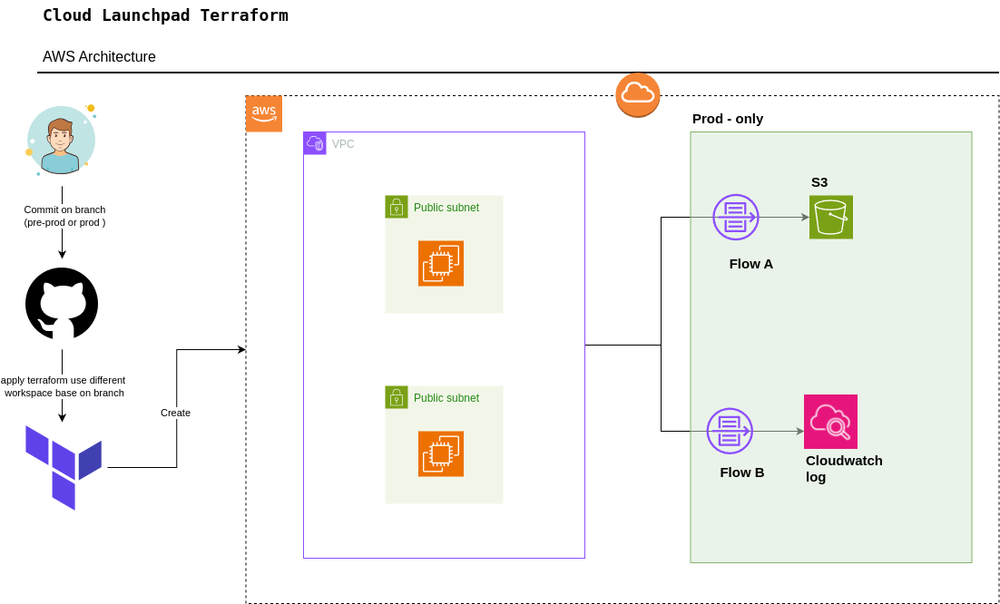

# Cloud Launchpad Terraform

This repository contains Terraform code to provision a modular AWS infrastructure, including VPC networking, compute resources, and logging, with support for multiple environments.

## Project Structure

- **main.tf**: Root configuration, wires modules together.
- **variables.tf**: Input variables for the project.
- **provider.tf**: Provider configuration (AWS).
- **pre-prod.tfvars / prod.tfvars**: Environment-specific variables.
- **modules/**
  - **network**: VPC and subnet resources.
  - **computer**: EC2 instances and security groups.
  - **logging**: CloudWatch and S3 logging (enabled only in `prod`).

## Usage

This project uses Terraform workspaces to manage different environments (pre-prod and prod). Each environment has its own set of variables defined in `pre-prod.tfvars` and `prod.tfvars`.

### Initialize

```sh
terraform init
```

###  write your tfvars files
Create `pre-prod.tfvars` and `prod.tfvars` files with the necessary variables for each environment. Example content:

```hcl

# pre-prod.tfvars
project_name = "poc-pre-prod"

# VPC Configuration
vpc_cidr_block = "10.0.0.0/16"

# Subnets Configuration
subnets_list = [
  {
    name              = "poc-pre-prod-subnet-public-1"
    cidr              = "10.0.1.0/24"
    type              = "public"
    availability_zone = "us-east-1a"
  },
  {
    name              = "poc-pre-prod-subnet-public-2"
    cidr              = "10.0.2.0/24"
    type              = "public"
    availability_zone = "us-east-1b"
  }
]

```

> **Note:** The number of `subnets` is the number of ec2 instances that will be launched in the `computer` module and this version of network module does not support `NAT` so if create private subnet you will not be able to log in inside it.

### Select Environment

```sh
terraform workspace new pre-prod
# and
terraform workspace new prod
```

### Plan

Note: select your environment by using `workspace` and by specifying the `-var-file` option.
```sh
terraform workspace select pre-prod
terraform plan -var-file=pre-prod.tfvars
# or
terraform workspace select prod
terraform plan -var-file=prod.tfvars
```

### Apply

```sh
terraform apply -var-file=pre-prod.tfvars
# or
terraform apply -var-file=prod.tfvars
```

## Modules

### Network

- Provisions a VPC and subnets as defined in `subnets_list`.

### Computer

- Launches EC2 instances in each subnet.
- Attaches a security group allowing SSH access.

### Logging

- Creates CloudWatch log groups and S3 bucket for VPC flow logs.
- Only enabled in the `prod` workspace.

## Notes

- Logging resources are only created in the `prod` environment.
- All resources are tagged with the project name for easy identification.
- Sensitive files (`*.tfvars`) are excluded from version control.

## Architecture

## Architecture



The architecture diagram illustrates the infrastructure deployed by this Terraform project, showing the relationship between VPC, subnets, EC2 instances, and logging resources.
